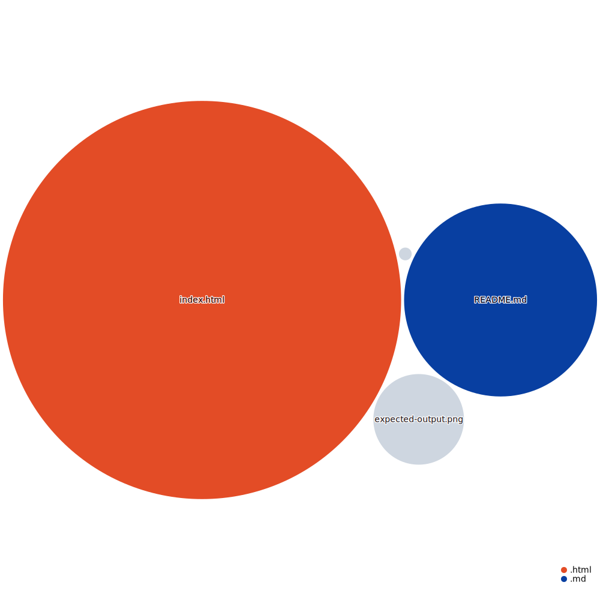

# dev-photo-gallery
Photo gallery

## Expected output

## Current link
[Page with error](https://anandrktm.github.io/dev-photo-gallery/) 

## Instructions
1. Find the errors
2. Fix the error
3. Mention the list of errors in your README.md file
4. Share your solution on your repository's [github page](https://pages.github.com/)
5. Raise a PR with the fix.
